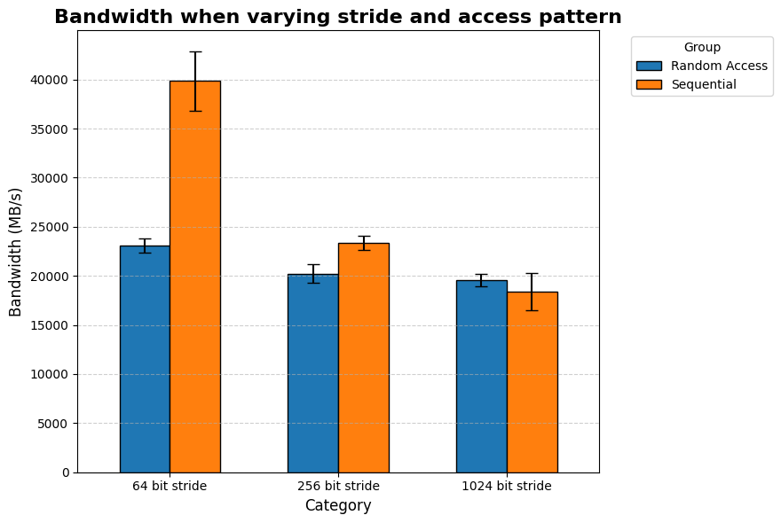
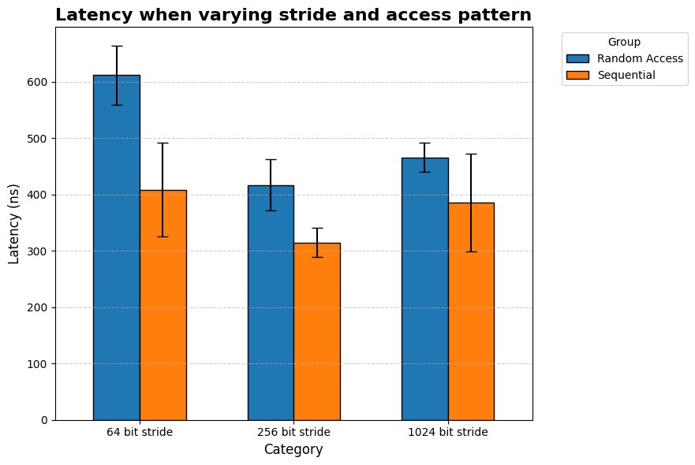
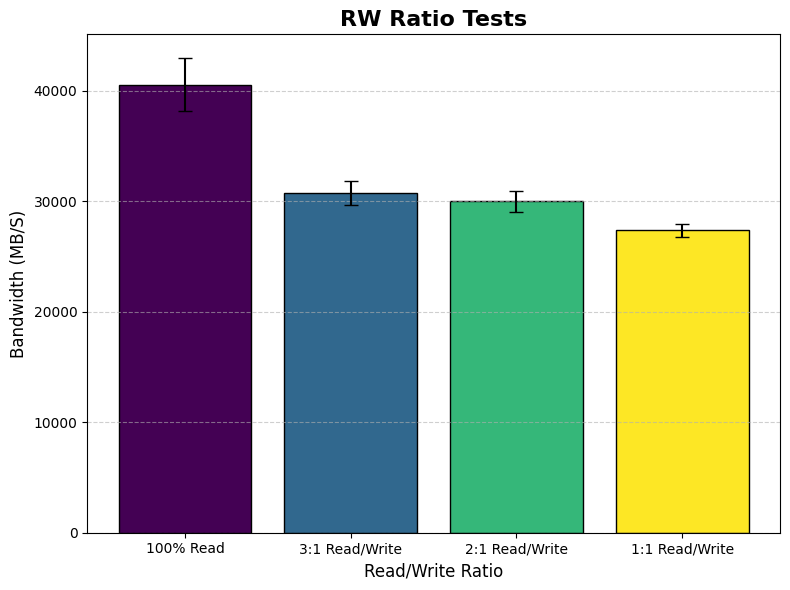
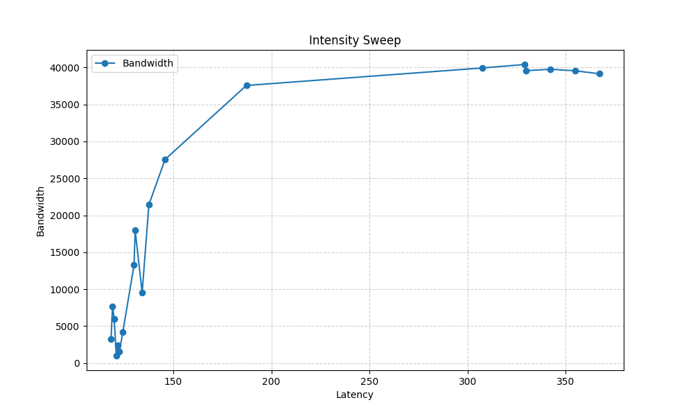
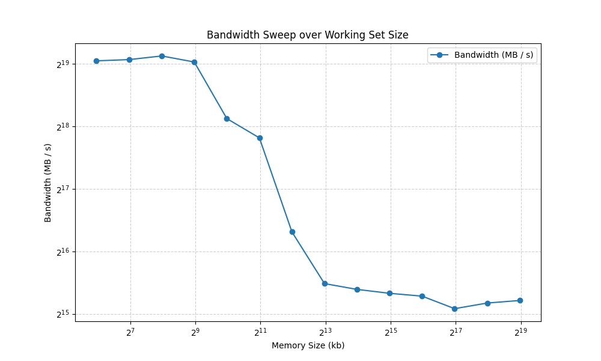

# Advanced Computer Systems Project 2

### Alek Krupka

## Zero Queue Baselines

The below data shows the zero queue baseline for when the buffer size is varied to be
over different memory localities.

This was accomplished by using the command,

```mlc.exe``` with the ```--idle_latency``` option which generates a zero queue
memory access latency in ns.  This data was then collected and put into a table
in which is shown below.  The ```-bn``` option was used to vary the access buffer
size to span over different memory localities.  Note that the values in the table
are the access latencies in ns.

| |L1|L2|LLC|DRAM|
|---|---|---|---|---|
|Memory Locality| 1.11| 4.23| 24.80| 99.56|

## Pattern and Granularity Sweep

For this section tests were conduction on a variety of different stride and access patterns.
These stride lengths and access patterns were achieved by using different options when running mlc (See the .bat file for exact configs).
The first way the data was categorized was by generating a table of 
stride x access patterns and the measured max bandwidth for each configuration.
This table is shown below.  Each value is represented in MB/s.

| |64 bit stride|256 bit stride|1024 bit stride|
|---|---|---|---|
|Sequential| 41402.86| 21445.98| 18642.86|
|Random Access| 23187.25| 20739.13| 19785.43|

The second way we can express the data is to show bar graphs of
how stride and access pattern effect the measured bandwidth and 
access latency.  Each of these plots are shown below.




As shown by the images above using a random access pattern over a sequential
pattern greatly hurts the overall bandwidth of the memory.
This is especially true of 64-bit stride patterns.  Other stride patterns
are more similar to each other.  Therefore, the main takeaway from these plots
are that sequential accesses with a small stride result in far higher memory efficiency
compared to accesses that are spread out.  Also note that for each stride the access
latency is smaller for sequential access than random access.

## Read / Write Sweep

The below plot shows the maximum achieved bandwidth for four different read and write ratios.
Note: the read / write ratios are not the same as listed in the packet since from what I have seen in the mlc documnetation,
a 100% write mode does not exist.  Therefore, we use the ratios,

1. 100% Read
2. 1:1 Read/Write
3. 2:1 Read/Write
4. 3:1 Read/Write

The bandwidth for each of these are in the plots below.



As the plot above shows, as the ratio of reads to writes decreases,
so too does the maximum achieved bandwidth.  This is most likely due
to the memory needing to spend more time writing which causes delays when
the reads occur.

## Intensity Sweep

The next chart shows the latency vs bandwidth
curve taken from ```mlc``` when it performs a loaded_latency sweep
over various injection rates.  This option measures memory access latency and
bandwidth given the various rates at which reads are added to the queue.  These
injection rates are the different intensities we tested at.



As shown, the graph forms a "knee" shape where the bandwidth no longer increases
even when memory latency increases more.

## Working Set Size Sweep

The next test conducted was a test when the various access sizes
were changed when the memory is under load.  This plot is shown below.



As shown, as the working set size increases the bandwidth drastically decreases.  Note that in
this image both axis are taken at a log scale for easier viewing.
Observe that the transition from L1 to L2 cache probably occurs
from approximately 512KB to 1MB.  The transition from L2 to LLC is most likely
around 1MB - 4MB and the transition from LLC to DRAM occurs around 8MB.
Another important observation is that even when working set size
is adjusted, as long as the locality does not change, the maximum bandwidth
appears to remain constant.  It is really in the middle area where problems appear to occur.