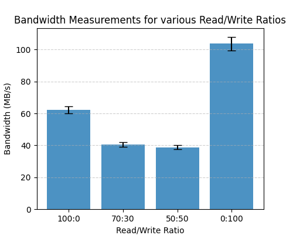

# Project 3 Report

### Aleksander Krupka

## Methodologies

In this project experiments were conducted to test harddrive read/write latencies and maximum bandwidths.

The program ```fio``` was used for running these tests and collecting data and the data is outputted to a .json file
with all the results after running.

### Separating Read/Write data

```fio``` automatically separates read/write statistics.  Since we would expect that 
read/write statistics would result in a dual peaked mean for all data, most plots shown split
read/write data to avoid this non-normality within the data.  The exception to this is the read/write
ratio sweep because this is specifically testing the overall latency/bandwidth data.  When combining
variances for these bar graphs a specific equation needed to be used since you cant just
add the variances.

## Zero Queue Baselines

Below are plots while keeping queue depth = 1 and performing random 4Ki random read writes vs 128Ki Sequential Read Writes.

The table below documents the average read/write latencies for each of these tests.

Additionally, the 95th and 99th percentiles for each run are shown in the table.  This table is shown below.


| |4Ki Random Reads|4Ki Random Writes|128Ki Sequential Reads|128Ki Sequential Writes|
|---|---|---|---|---|
|Average Latency(us)|52.87|18.78|41.05|19.08|
|Latency variance(us)|48.31|19.35|50.50|17.63|
|95th Percentile Latency(us)|56.58|20.61|56.06|21.89|
|99th Percentile Latency(us)|129.54|39.17|127.49|70.14|

One odditity with the data is that the random reads have greater latency than reads.  This should not be the case
as reads should be faster than writes.

Another note is that the cache should have been bypassed since the fio application was used.

## Block Size and Pattern Sweep

The next experiment conducted was a block size and pattern sweep.  This test
was conducted by varying the block size while all other conditions were kept the same.
The latencies were split by read/writes due to the reason stated in the methodologies section
of the report.

Each plot shows the bandwidth and IOPS on separate axis so that that crossover
from IOPS to bandwidth can be seen.  The first set of plots show 4Ki random read/writes data
while the second set of plots the block sweep data over 128Ki sequential read/writes.


For all plots of data, the crossover between IOPS and Bandwidth seems to occur
around a block size of 48Ki.  The Bandwidth starts low and increases with block size
while the IOPS start high and decreases with block size.

## Read/Write Matrix Sweep

The next emperiment conducted was varying the read write ratios
for different runs and reporting both the bandwidth and latency.
Both bandwidth and latency are plotted using separate graphs since using the
same bar graph wouldn't be feasible since they are in completely
different units.  These bar graphs are shown below.




One confusing thing about the data is that the variance is both latency and bandwidth
are extremely high.  The data was confirmed that the values were being read in correctly
by the Python script so it is most likly an issue with fio or test conditions.
This oddity could also have been due to write buffering or flushes.

As shown though as the read to write ratio decreases, so too does the bandwidth which is most likely
a result of reads being faster than writes.  One oddity though is that
for a 100% write ratio the mean bandwidth is much higher than even the 100% read ratio
breaking the expected pattern.

## Queue Depth / Parallelism Sweep

An experiment on Queue Depth and how it effects bandwidth / latency was also
conducted in this project.  In this experiment the queue depth was varied by
powers of 2 from 1 to 32.  One datapoint was collected from each job where the average
bandwidth was plotted over the average latency.  This is used to explain
littles law as when latency increases, bandwidth also increases up until a maximum
which is known as the "knee".  The below plots show this for
reads and writes separately.


As seen, for both reads and write the upper limit for throughput appears to be around
180MB/s on the computer in which these tests were conducted.

This "knee" occurs due to the queue being empty and being solely the idle read time as
the queue depth is low enough to the point where the memory could have a larger queue
depth but it just isnt being used.

## Tail Latencies

The final experiment conducted was a tail latency experiment where the 50th, 95th, 99th, and 99.9th percentiles
for latencies were collected.  The results of this are shown in a table format where
the columns are the different percentiles and the rows are the different IO dpeths found from
the last experiment.  This table of data is shown below is for writes.

| |50th Percentile|95th Percentile|99th Percentile|99.9th Percentile|
|---|---|---|---|---|
|Queue Depth = 1|51.97|57.60|132.10|209.92|
|Queue Depth = 2|51.46|77.31|158.72|1302.53|
|Queue Depth = 4|53.50|92.67|162.82|220.16|
|Queue Depth = 8|67.07|121.34|185.34|296.96|
|Queue Depth = 16|116.22|193.54|321.54|2244.61|
|Queue Depth = 32|203.78|350.21|432.13|749.57|

And this table is for the various reads.

| |50th Percentile|95th Percentile|99th Percentile|99.9th Percentile|
|---|---|---|---|---|
|Queue Depth = 1|17.54|20.35|68.10|132.10|
|Queue Depth = 2|16.77|22.91|62.21|138.24|
|Queue Depth = 4|18.30|40.70|67.07|132.10|
|Queue Depth = 8|37.63|76.29|98.82|183.30|
|Queue Depth = 16|77.31|150.53|187.39|419.84|
|Queue Depth = 32|164.86|313.34|374.78|593.92|

One important thing to note about the data is that the 99.9th percentile
varies widely which is most likely due to outliers within the dataset.
As shown, the knee latency most likely occurs after a queue depth of around
8 since that is the latency where the "knee bandwidth" is on the original plot.
