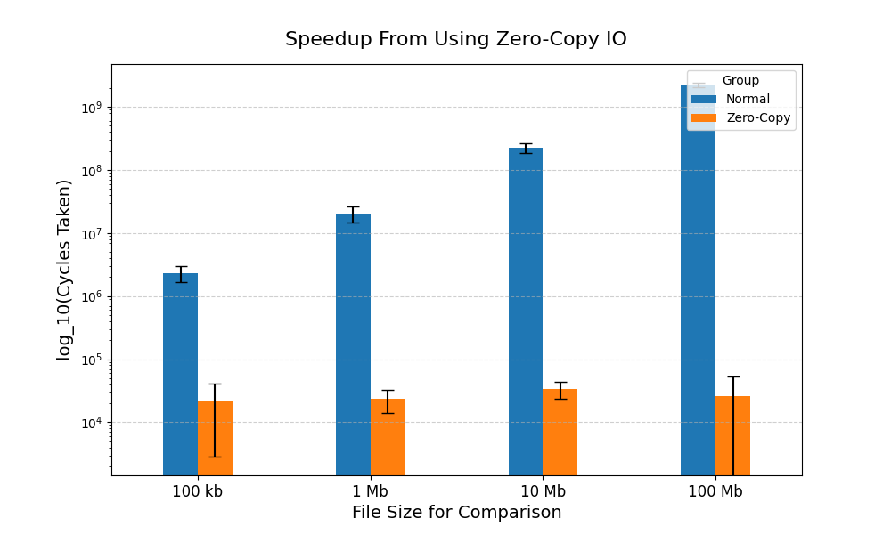

# Advanced OS and CPU Feature Report
## Alek Krupka

## Introduction

This project implements benchmarks advanced OS features and attempts to quantify
how these features can impact performance.  This report is divided into sections with
each one detailing a different OS feature.  The split is done because most features needed to be benchmarked
in different manners.

## Zero-Copy IO

### Introduction

The zero-copy IO feature benchmarks the windows operating system's memory mapped IO feature.
For this experiment, we simply compared the strings contained by two files using zero-copy IO
and the normal method of reading the contents into a buffer and then running the compare function.
The compare function was chosen because it is a simple operation and does not have any of the overhead for
printing the contents of the file.  The tests conducted simply collect the number of cycles
it took to complete the comparison for varying file sizes.  The files were generated randomly using
a python script and each test was run 10 times to ensure proper output.

### Methodologies

As noted, the number of cycles to perform a comparison is recorded in the results.  However,
one important note is that the time to generate the file pointers and memory maps are NOT included
when calculating the number of cycles.  Meanwhile, the time it takes the processor
to read data into the buffer is calculated in the overall time it takes to compare the
strings.  This was done since otherwise, we would not be considering the copy.

### Results
The table below shows the performance difference when using zero-copy IO vs fread and comparing the string.
Since the performance vastly varied from zero-copy IO to normal copy, the plot is shown on a logarithmic scale.

As shown by the plot, the comparison time does not really increase for the zero-copy
comparison while reading the file normally results in a far slower operation (Roughly 2000k worse at 100Mb Files).

These results make sense as the zero copy IO is most likely done through hardware meaning the reads
are far faster than if the data had to be put into a buffer as well.

### Future Improvements

A future improvement that could be made to this test is using the strings in a more meaningful way.
However, this experiment was kept simple so that no other factors could affect performance.