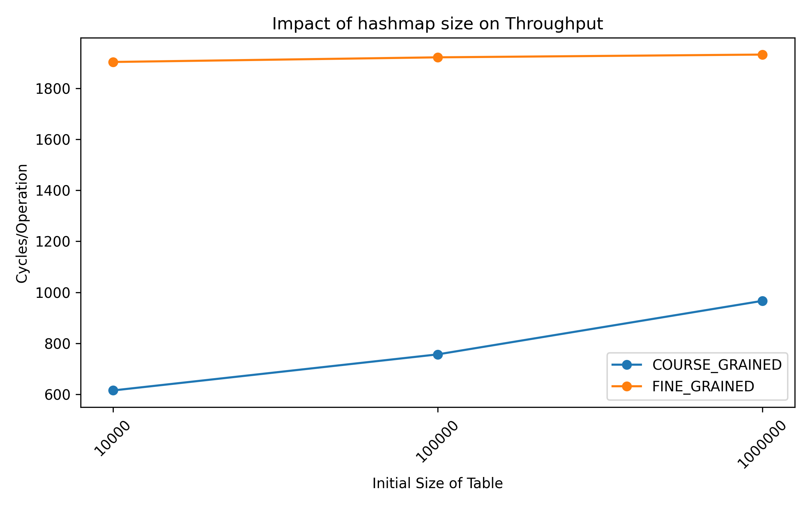
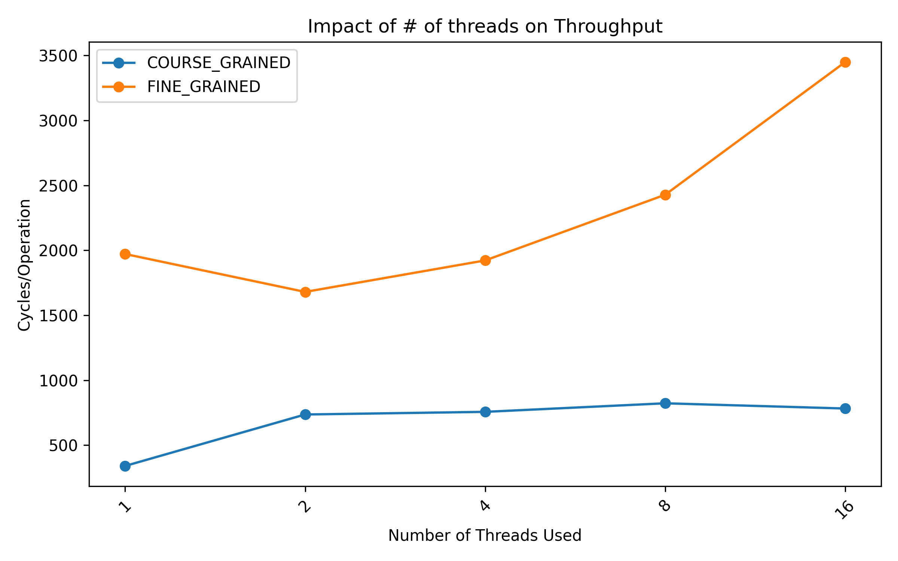
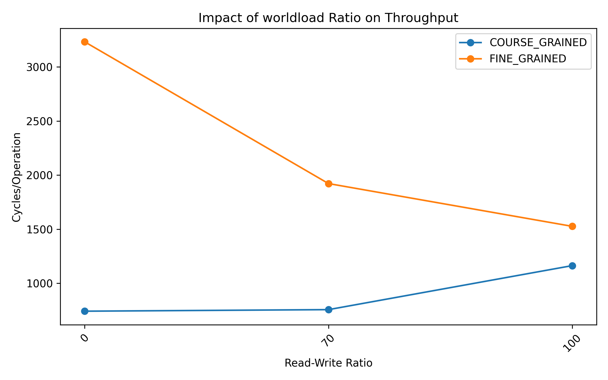
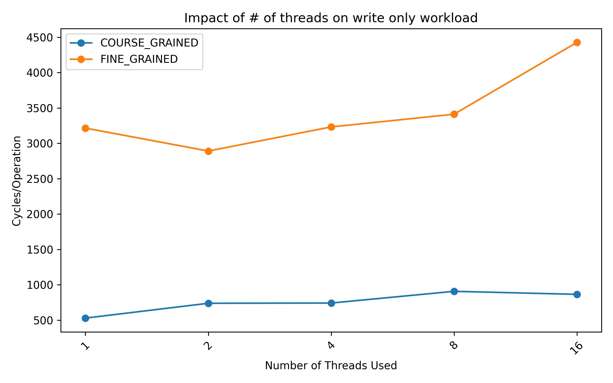
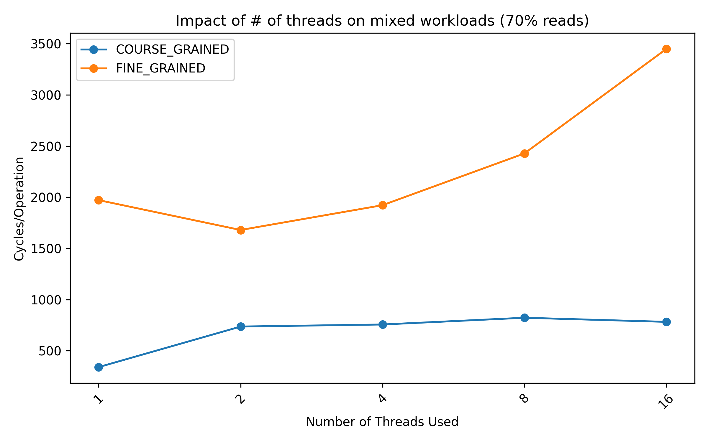
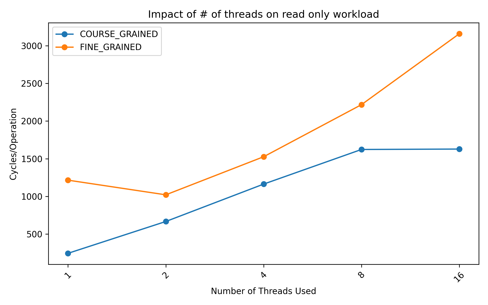

# Concurrent Data Structures Report 1 Report
## Alek Krupka

## Introduction

This project builds a concurrent hash table which is a normal table that allows
for simultaneous reads and writes to the structure by multiple threads.  The goal of this project is to show how
different locking mechanisms impact the performance of a workload and show how threads have the potential to speed 
up these workloads.

## Hashmap Implementation Details

The hashmap that was implemented and used for the data generated in this report uses
a separate chaining protocol and resizes when the hashmap becomes around 50% full.
Separate chaining was used because fine-grained locking would have been extremely difficult
(and possibly inefficient) to implement concurrently.  This is because
any section a read may touch needs to be locked as soon as the read starts, otherwise
a race condition could occur.  This may be a nonissue though since if two threads
are each calling inserts, the user clearly does not care about order.  Nevertheless,
this type of locking still occurs.

### A Note About Shared vs Unique Locks
The implemention used mutexes from the C++ standard library along with what the standard defines as
unique and shared locks.  Per the documentation, unique locks
can be put on a mutex if and only if no other operations have a unique or shared lock on
the mutex.  Shared locks on the other hand allow for multiple threads to obtain
shared locks on the mutex while preventing unique locks until all shared locks are lifted
from the mutex.  The documentation for unique locks is below.

https://en.cppreference.com/w/cpp/thread/unique_lock.html

### Course-Grained Locking Details
For the course grained implementation of the hashmap, a global lock is acquired by a thread
for every operation.  Below lists the implementation details for each function

1. Inserts - A unique global lock must be acquired before inserts occur.  We don't want any issues of changing
the structure when a read occurs.
2. Reads - A global shared lock must be acquired before a write occurs.  This means that multiple reads can occur
at a time, but a read cannot occur during a write for course locking.
3. Resizing (Size double) - A global lock is acquired and no other operations may occur while resizing
the table as every index is affected.
4. Erase - A gloal unique lock must be acquired before erasing.  For course grained we just need to prevent all other
operations on the table.

### Fine-Grained Locking Details
For the fine-grained implementation of the hashmap, each index of the map has its own
lock allowing for a read to occur even if a write is occuring somewhere else in the hashmap.
This should ideally increase parallelism between threads ultimately providing a speedup.

1. Inserts - A unique lock must be acquired at a specific index for an insert to occur.  Insert doesnt change the entire structure
of the hashtable meaning that we only care about the bucket for which we are inserting.  A shared lock must also be acquired
incase a resize is occuring when an insert is attemped.
2. Reads - Both a shared global lock and index-based lock must be acquired before reading.
The former is to ensure reads aren't being conducted during resizes
while the ladder ensures that the thread isnt trying to read a bucket currently
being written to.
3. Resizing (Size double) - A unique global lock is acquired and no other operations may occur while resizing
   the table as every index is affected.
4. Erase - Both a shared global lock and unique index lock must be acquired for the same reason
that these locks need to be acquired for inserts.

### Concurrency implementation summarization

Overall, we say that operations which effect data must acquire unique
locks on a mutex while read operations may obtain shared locks.

## Experiment Notes

### How data was generated

1. For all experiments, random keys and random values were generated using the entire
32-bit range.  
2. Before tests are conducted the hashtable is pre-populated with random
data equivalent to the dataset size.  This is done to ensure performance is relatively
uniform throughout the test.
3. For data to be used for testing performance, we use the desired read-write ratio to determine the number of
operations that can be performed without massively varying the table.  For these experiments
I decided that I did not want the hash table to grow by more than a factor of 3 times the initial size.  This
means that more operations are done for tests using higher read ratios.  For 100% reads, we perform the number
of operations equal to 10x the intial table size.
4. Writes are easy to produce, we just tell the table to put in a random value.
5. Each read uses a coin-flip to determine whether the data to look up should already be in the table
or whether it should be a value not in the table.  For values in the table, we attempt to look up
a key used for the initial dataset.  For negative lookup keys we just produce a random number and hope it was
not actually added by an insert.  Since there are 2^32 different keys this chance is pretty low.  However, it is
still possible for the random key to be found in the table which is why an accuracy for reads is recorded in the data.
Note however that for 100% inserts, this value is "nan" as the accuracy is only really useful for reads.
6. All operations a stored prior to each thread running them to minimize any inefficiencies with the test.
7. The main metric collected is cycles/operation.  This metric was chosen as it is not effected by things
such as the CPU clock frequency.  Additionally, clock cycles can be easily found using the rdtsc register on windows
which is where these tests were conducted.
8. All datapoints shown are the average of 5 separate test runs.

## Results

### Set Sizes Impact on Throughput

Below, the figure shows how the size of the initial table
impacts the amount of cycles each operation takes.  Note that
this plot uses data where the number of threads is pinned to 4 and
using a mixed read/write ratio.

As seen by the plot the course grained implementation is more efficient for 
all datapoints but degrades with size of the hash table.  Meanwhile, the fine-gained
performance remains relatively constant.  This could be because as the hash table grows
larger the cache misses caused by the increased table size begin to outweigh
the inefficiencies caused by the additional overhead of fine-grained locking.
The fine-grained locking though with its increased parallelism can switch to a different
thread while loading from DRAM meaning the increased cache misses are not as impactful.
Future research should see if fine-grained eventually does better than course-grained with increased
test sizes.

### Thread count impact on throughput

The figure below shows how the number of threads being
used to complete the workload impacts the total number cycles per operation.
Note that, increasing the thread count does not increase the total amount of work.
Ie) If the workload is 20000 operations for 1 thread, each thread in the 16-thread data
will only perform 20000/16 operations.  This means that if the implementation
was being run fully in parallel, the 16 thread results should be 16x faster than the 1 thread result.

As shown, threading makes the best impact when using a fine-grained implementation with 2 threads.
However, increasing the number of threads causes the performance to become significantly worse especially
with the fine-grained results.  For the course-grained implementation, the throughput is highest at 1 thread
but does not significantly degrade with more threads.  While the implementation of the hash table is correct,
the unexpected results could have been due to thread overhead and the CPU not fully parallelizing the workload
even with more threads.

### Workload Impact on throughput

The first figure shown below outlines the impact of course vs fine-grained
locking when the workload is varied and the number of threads is kept at 4.
For this test the dataset size was set to 10^6 to show its impact on large datasets.

As seen, fine-grained locking performs significantly worse for high write workloads while
the difference is less drastic for the course grained results.  Additionally, the course grained
implementation performs far better with a low read/write ratio while
the course grained implemented is significantly worse for high ratios.
As noted the fine-grained implementation performs significantly better where more
reads are done means.  This could be caused by threads trying to write being
stuck for a long time trying to obtain the mutex and not being able to causing the thread to take
way more time to complete.  This contention leads to false-parallelism which could causes 
the data to look like the results below.

Next, we show how different read write ratios effect the overall performance of the structure when
the threads are varied.  The three figures below show the data swept
across thread count for each of the three read/write ratios.

As shown by all three images, figures the fine-grained implementation performs
best at two threads for all three ratios while the course grained 
implementation overall performs the best with 1 thread.  This data is not what we would expect
as we would expect multithreading to show performance increases rather than decreases.
We would expect however, that multithreading is far less effective with more threads
due to the increased contention which is argued by Amdahl's Law.

## Conclusion

To conclude, we see that the parallelized data structure is not very effective especially
for small datasets such as the ones this was tested on.  However, as seen earlier in the report,
the threading performance closes the gap on the single-threaded performance as the dataset size increased.
This gives promise that when implemented on large databases at places such as Google or Oracle, that the multi-threaded
implementation could provide actual speedup rather than being slower.
