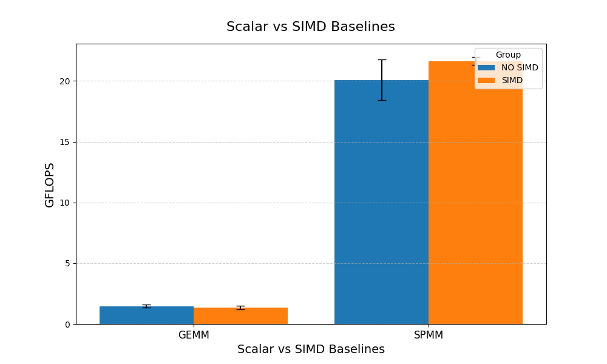
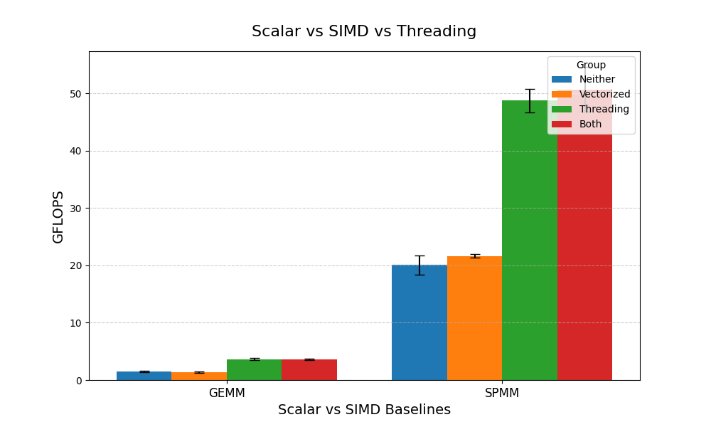
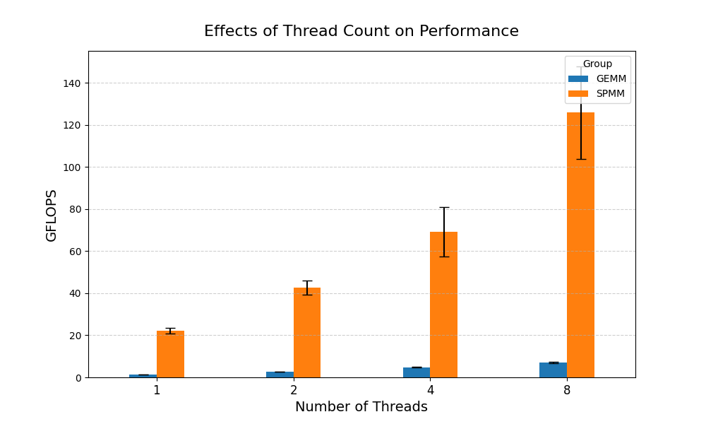
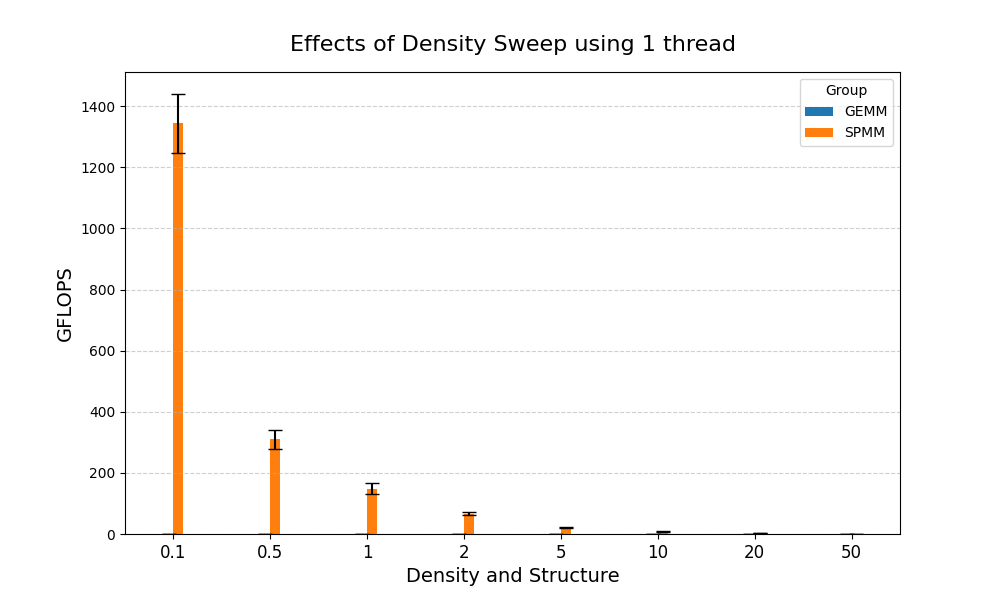
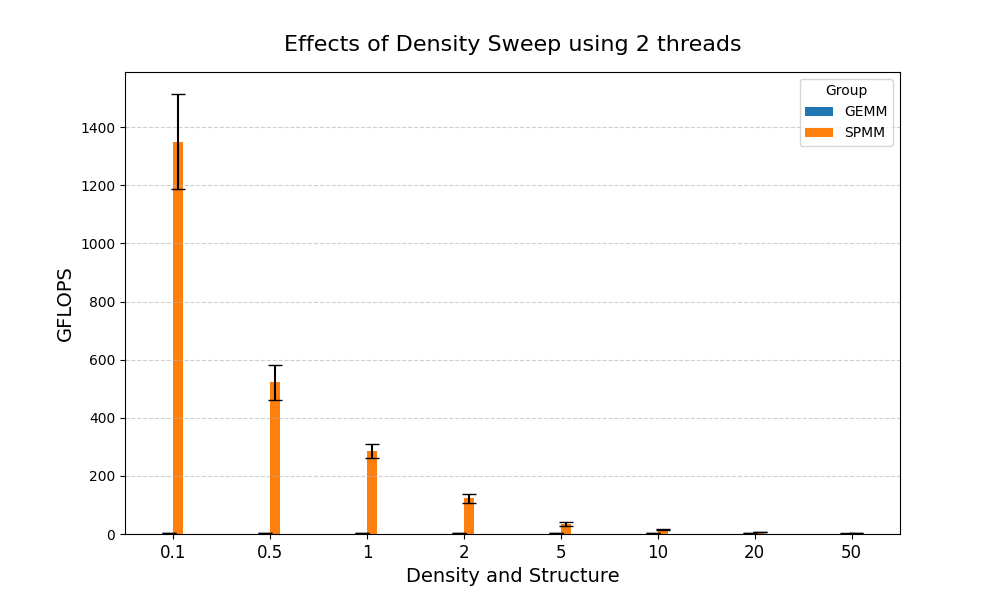
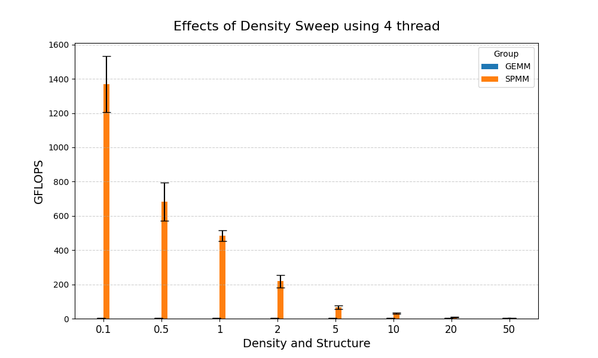
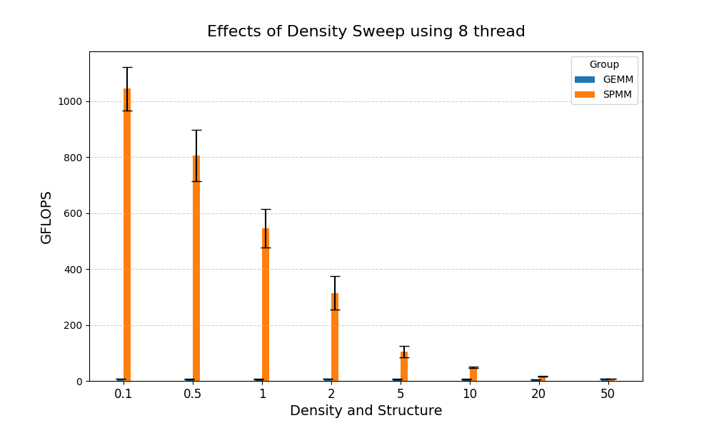

# Matrix Multiplication Project Report
## Alek Krupka

## Introduction

This report outlines a testing procedure to test the performance of dense x dense (GEMM) and
spare x dense (SPMM) matrix multiplication under a variety of varying parameters.  The
varied parameters include the following.

1. SPMM vs GEMM multiplication
2. SIMD and VECTORIZATION
3. Number of threads used to compute the result
4. Tile size for cache-aware tiling of GEMM multiplication
5. Sparsity of the matrix (sparsity = 20) implies only 20% of values
in the matrix are nonzero.
6. Matrix size ie(1024 x 8) times (8x 256)

The code written allows the first four parameters to be changed using different build
defines while the last two parameters are changed using command line arguments.

The reason the parameters are changed this way is to maximize performance when running the code
and #defines allow things like thread count to be more easily optimized into the code.  For the
sparsity, this only affects how the matrix is produced, meaning that there is no performance
loss by assigning these values to variables and branching.  For things like SPMM vs GEMM I did not
want any branching to cause a decrease in performance, which is why that setting is a #define.

## Testing Done To Ensure Correctness

A basic matrix of all 1s was used for the tiling options and threading
to ensure correctness of the algorithm.  Separate tests were conducted to ensure these matrices
were evaluated correctly.

## A Note on Tiling
For the GEMM algorithm, tiling was used to reduce cache misses.
No data was needed for the effects of different tile sizes so all tests were conducted with a tile size
of 4 even though the built applications for different tiling sizes are included within the build.

## Scalar vs SIMD Single Thread Baselines

Below is the baseline performance plot for the scalar vs SIMD
performance of GEMM and SPMM.

As shown, SIMD performed slightly better than the scalar implementation
for sparse matrix multiplication while performing slightly worse for dense matrix
multiplication.  Overall, sparse matrix multiplcation performed far better than
dense for both tests, most likely because far fewer operations
needed to be performed for dense multiplication.

## Effects of SIMD and Threading on Performance

Now, we include the data when threading is added to the implementation.
For this implementation, each operation was completed by 4 threads allowing
the job to be done much faster.

As shown, adding multithreading almost doubles the speed of the process and has a far
greater impact than just SIMD.  However, SPMM still far outperforms GEMM
by a wide margin.

Next, the following plot shows the results when the number of threads used are
swept from 1-8.

As shown, for both the GEMM and SPMM algorithms, adding more
threads vastly increased the efficiency of computing the multiplication.
This again shows that increased thread count yields better results.

## Effects of Size and Memory on Performance

The following tables show the performance in GFLOPS with varying sizes
of the matrix.  Each table represents a size sweep aimed at a specific size.
Under matrix multiplication, a matrix (m x k) and (k x n ) are multipliced to produce
a (m x n) matrix.  The rows of each table represent the size of m while
the columns represent the size of n.  For each index of the table a "k" value
is selected to match the target size.  The sizes are swept to cover varying caches and dram.
The exact target sizes are listed.

1. L1 Cache - 32k
2. L2 Cache - 2MB
3. L3 Cache - 20MB
4. DRAM - 60MB

### GEMM Matrix multiplication sweep over L1 cache.

| |16|64|256|1024|2048|4096|
|---|---|---|---|---|---|---|
|16|(k = 64) : 2.53|(k = 64) : 2.74|(k = 16) : 2.60|(k = 16) : 2.63|(k = 16) : 2.41|(k = 16) : 2.05|
|64|(k = 64) : 2.57|(k = 16) : 2.92|(k = 16) : 2.74|(k = 16) : 2.64|(k = 16) : 2.33|(k = 16) : 2.03|
|256|(k = 16) : 2.66|(k = 16) : 2.07|(k = 16) : 2.58|(k = 16) : 2.22|(k = 16) : 2.13|(k = 16) : 1.96|
|1024|(k = 16) : 2.89|(k = 16) : 2.92|(k = 16) : 2.48|(k = 16) : 2.35|(k = 16) : 2.20|(k = 16) : 2.03|
|2048|(k = 16) : 2.68|(k = 16) : 2.59|(k = 16) : 2.16|(k = 16) : 2.20|(k = 16) : 2.25|(k = 16) : 2.00|
|4096|(k = 16) : 2.77|(k = 16) : 2.51|(k = 16) : 2.40|(k = 16) : 2.24|(k = 16) : 2.33|(k = 16) : 1.93|

### SPMM Matrix multiplication sweep over L1 cache.

| |16|64|256|1024|2048|4096|
|---|---|---|---|---|---|---|
|16|(k = 64) : 21.74|(k = 64) : 29.45|(k = 16) : 38.50|(k = 16) : 22.07|(k = 16) : 41.01|(k = 16) : 22.45|
|64|(k = 64) : 24.01|(k = 16) : 24.50|(k = 16) : 29.33|(k = 16) : 39.74|(k = 16) : 21.49|(k = 16) : 28.33|
|256|(k = 16) : 19.70|(k = 16) : 22.63|(k = 16) : 21.40|(k = 16) : 25.30|(k = 16) : 18.95|(k = 16) : 32.45|
|1024|(k = 16) : 21.12|(k = 16) : 27.67|(k = 16) : 25.52|(k = 16) : 25.27|(k = 16) : 30.80|(k = 16) : 26.85|
|2048|(k = 16) : 19.19|(k = 16) : 27.22|(k = 16) : 27.16|(k = 16) : 25.35|(k = 16) : 26.82|(k = 16) : 28.57|
|4096|(k = 16) : 19.28|(k = 16) : 25.57|(k = 16) : 27.55|(k = 16) : 27.67|(k = 16) : 26.98|(k = 16) : 24.32|

### GEMM Matrix multiplication sweep over L2 cache.

| |16|64|256|1024|2048|4096|
|---|---|---|---|---|---|---|
|16|(k = 4096) : 2.47|(k = 4096) : 1.97|(k = 1024) : 1.91|(k = 256) : 1.79|(k = 64) : 2.09|(k = 64) : 1.87|
|64|(k = 4096) : 2.14|(k = 2048) : 2.21|(k = 1024) : 1.97|(k = 256) : 1.94|(k = 64) : 2.11|(k = 64) : 1.91|
|256|(k = 1024) : 2.24|(k = 1024) : 1.91|(k = 256) : 2.08|(k = 256) : 1.87|(k = 64) : 1.98|(k = 64) : 1.79|
|1024|(k = 256) : 2.33|(k = 256) : 2.34|(k = 256) : 2.27|(k = 64) : 2.10|(k = 64) : 1.98|(k = 64) : 1.99|
|2048|(k = 64) : 2.65|(k = 64) : 2.53|(k = 64) : 2.36|(k = 64) : 1.93|(k = 64) : 1.80|(k = 64) : 1.92|
|4096|(k = 64) : 2.24|(k = 64) : 2.38|(k = 64) : 2.29|(k = 64) : 2.11|(k = 64) : 2.03|(k = 16) : 1.93|

### SPMM Matrix multiplication sweep over L2 cache.

| |16|64|256|1024|2048|4096|
|---|---|---|---|---|---|---|
|16|(k = 4096) : 24.07|(k = 4096) : 21.26|(k = 1024) : 26.65|(k = 256) : 30.33|(k = 64) : 27.71|(k = 64) : 35.68|
|64|(k = 4096) : 22.62|(k = 2048) : 23.24|(k = 1024) : 27.47|(k = 256) : 37.20|(k = 64) : 36.44|(k = 64) : 32.87|
|256|(k = 1024) : 28.26|(k = 1024) : 27.52|(k = 256) : 36.76|(k = 256) : 32.99|(k = 64) : 28.58|(k = 64) : 30.25|
|1024|(k = 256) : 34.60|(k = 256) : 37.20|(k = 256) : 36.63|(k = 64) : 34.02|(k = 64) : 33.01|(k = 64) : 34.50|
|2048|(k = 64) : 26.81|(k = 64) : 34.12|(k = 64) : 35.29|(k = 64) : 31.36|(k = 64) : 30.65|(k = 64) : 32.82|
|4096|(k = 64) : 26.08|(k = 64) : 32.66|(k = 64) : 34.32|(k = 64) : 35.02|(k = 64) : 31.60|(k = 16) : 24.32|

### GEMM Matrix multiplication sweep over LLC.

| |16|64|256|1024|2048|4096|
|---|---|---|---|---|---|---|
|16|(k = 4096) : 2.47|(k = 4096) : 1.97|(k = 4096) : 1.57|(k = 2048) : 1.28|(k = 1024) : 1.37|(k = 256) : 1.69|
|64|(k = 4096) : 2.14|(k = 4096) : 1.89|(k = 4096) : 1.77|(k = 2048) : 1.12|(k = 1024) : 1.36|(k = 256) : 1.68|
|256|(k = 4096) : 2.17|(k = 4096) : 1.97|(k = 4096) : 1.87|(k = 2048) : 1.32|(k = 1024) : 1.44|(k = 256) : 1.42|
|1024|(k = 2048) : 2.26|(k = 2048) : 2.22|(k = 2048) : 2.13|(k = 1024) : 1.74|(k = 1024) : 1.28|(k = 256) : 1.71|
|2048|(k = 1024) : 2.22|(k = 1024) : 1.97|(k = 1024) : 1.95|(k = 1024) : 1.51|(k = 256) : 1.66|(k = 256) : 1.62|
|4096|(k = 256) : 2.25|(k = 256) : 2.28|(k = 256) : 2.23|(k = 256) : 1.97|(k = 256) : 1.88|(k = 256) : 1.87|

### SPMM Matrix multiplication sweep over LLC.

| |16|64|256|1024|2048|4096|
|---|---|---|---|---|---|---|
|16|(k = 4096) : 24.07|(k = 4096) : 21.26|(k = 4096) : 19.93|(k = 2048) : 17.62|(k = 1024) : 22.49|(k = 256) : 30.39|
|64|(k = 4096) : 22.62|(k = 4096) : 21.23|(k = 4096) : 9.97|(k = 2048) : 16.04|(k = 1024) : 20.31|(k = 256) : 31.13|
|256|(k = 4096) : 19.45|(k = 4096) : 19.38|(k = 4096) : 16.37|(k = 2048) : 19.62|(k = 1024) : 22.69|(k = 256) : 32.87|
|1024|(k = 2048) : 25.04|(k = 2048) : 25.13|(k = 2048) : 22.36|(k = 1024) : 24.84|(k = 1024) : 21.55|(k = 256) : 30.81|
|2048|(k = 1024) : 26.87|(k = 1024) : 27.14|(k = 1024) : 27.06|(k = 1024) : 22.31|(k = 256) : 32.55|(k = 256) : 33.85|
|4096|(k = 256) : 33.92|(k = 256) : 36.22|(k = 256) : 34.85|(k = 256) : 33.63|(k = 256) : 32.17|(k = 256) : 33.31|

### GEMM Matrix multiplication sweep over DRAM.

| |16|64|256|1024|2048|4096|
|---|---|---|---|---|---|---|
|16|(k = 4096) : 2.47|(k = 4096) : 1.97|(k = 4096) : 1.57|(k = 4096) : 0.96|(k = 4096) : 0.86|(k = 2048) : 0.98|
|64|(k = 4096) : 2.14|(k = 4096) : 1.89|(k = 4096) : 1.77|(k = 4096) : 0.92|(k = 4096) : 0.92|(k = 2048) : 0.98|
|256|(k = 4096) : 2.17|(k = 4096) : 1.97|(k = 4096) : 1.87|(k = 4096) : 0.91|(k = 4096) : 0.88|(k = 2048) : 1.01|
|1024|(k = 4096) : 2.18|(k = 4096) : 2.09|(k = 4096) : 1.65|(k = 4096) : 0.94|(k = 2048) : 1.06|(k = 1024) : 1.08|
|2048|(k = 4096) : 2.20|(k = 4096) : 2.13|(k = 4096) : 1.86|(k = 2048) : 1.22|(k = 2048) : 1.13|(k = 1024) : 1.02|
|4096|(k = 2048) : 2.15|(k = 2048) : 2.09|(k = 2048) : 1.83|(k = 1024) : 1.69|(k = 1024) : 1.38|(k = 1024) : 0.99|

### SPMM Matrix multiplication sweep over LLC.

| |16|64|256|1024|2048|4096|
|---|---|---|---|---|---|---|
|16|(k = 4096) : 24.07|(k = 4096) : 21.26|(k = 4096) : 19.93|(k = 4096) : 9.90|(k = 4096) : 7.51|(k = 2048) : 8.02|
|64|(k = 4096) : 22.62|(k = 4096) : 21.23|(k = 4096) : 9.97|(k = 4096) : 10.60|(k = 4096) : 8.57|(k = 2048) : 7.76|
|256|(k = 4096) : 19.45|(k = 4096) : 19.38|(k = 4096) : 16.37|(k = 4096) : 10.48|(k = 4096) : 9.65|(k = 2048) : 8.55|
|1024|(k = 4096) : 23.26|(k = 4096) : 18.50|(k = 4096) : 20.10|(k = 4096) : 10.69|(k = 2048) : 15.97|(k = 1024) : 23.23|
|2048|(k = 4096) : 23.08|(k = 4096) : 20.31|(k = 4096) : 15.89|(k = 2048) : 17.88|(k = 2048) : 15.62|(k = 1024) : 21.56|
|4096|(k = 2048) : 25.13|(k = 2048) : 21.03|(k = 2048) : 20.71|(k = 1024) : 23.33|(k = 1024) : 19.90|(k = 1024) : 21.46|

Overall, the trend is that larger values of "m" resulted in better performance for sparse matrix multiplication.  Additionally,
the extra cache misses for the larger sweeps did not seem to affect performance as indicated by all the GFLOPS for
GEMM being around 2.14 GFLOPS.  We also notice that size sweep does not play a big impact on SPMM
performance.  These results may be due to cache prefetching or other os structures causing fewer cache
misses for the operations.

## Arithmetric Intensity Analysis and Roofline Performance

For the GEMM algorithm, the peak performance is around 8GFLOPS with threading and SIMD
enabled.  For SPMM, this is about 120GFLOPS, however, since SPMM reduces the overall number of operations
and the metric still uses the expected number of operations in GEMM, this value is probably has
much higher performance than the CPU can actually achieve.

For both algorithms, we used double floating point numbers meaning our arithmetic intensity is 8.

Therefore, we compute a roofline performance of around 64GB for GEMM and around
940GFLOPS of SPMM (though again this one is flawed).  In theory, the memory bandwidth of the machine being tested
is 40GB / s as determined in a previous project for this course meaning we are getting slightly better performance most likely due to cache prefetching.

## Density Sweep and SPMM performance

The following 4 plots show the results when the sparsity of the matrix is swept from
0.1% dense to 50% dense.  Note that lower percents imply the matrix is more sparse.

The plots shown above clearly show that matrices which are more sparse
can be computed far more efficiently than dense matrices.  One interesting
note is that the tests run on sparser matrices perform better with lower
thread counts while higher thread counts outperform when
the matrix is less sparse.  These results may due to the fact that more sparse matrices
can be computed faster meaning the thread overhead is more costly on these tests.

For the break-even point of sparseness, we see that the results for spare matrix muliplication
is significantly faster for any number of threads up until around 30%-50% sparseness.  For matrices
less than 30% sparse, SPMM is significantly faster than the GEMM algorithm even
when tiling is implemented for the GEMM algorithm.  Again, this is most likely due to the fact that more operations
are required for GEMM.  While there are fewer overall operations in SPMM, the arithmetic intensity for STMM is a lot higher
than GEMM meaning at some point the fact that more overhead is required to SPMM causes this break-even point.

## Conclusion

Looking at the data, the main conclusion we can see is that the sparse matrix representation
is far faster than dense multiplication as the matrix is increasingly spare.  Additionally, multithreading proved to 
provide a massive speedup especially on larger matrices.  Other than that, no other factors appeared to make a major
impact on performance.  Even SIMD did not impact performance as much as one would think.

## Sources

I used the following two sources to help with the implementations of the matrix
multiplication algorithms.

1. [GEMM Algorithm](https://www.cs.sfu.ca/~ashriram/Courses/CS7ARCH/hw/hw4.html#github-clone-link)
2. [SPMM Representation](https://en.wikipedia.org/wiki/Sparse_matrix#Compressed_sparse_row_(CSR,_CRS_or_Yale_format))

